# Microsoft Defender Phishing Simulation Lab

Configured and executed an enterprise phishing simulation using **Microsoft Defender for Office 365 Attack Simulation Training** to evaluate user susceptibility to credential harvesting attacks. The lab demonstrates the complete phishing lifecycle, from campaign configuration and email delivery to credential capture, reporting, and automated security awareness training.

---

## Overview

This project simulates a real-world phishing campaign targeting Microsoft 365 users. A credential harvesting attack was configured using Microsoft's built-in phishing simulation capabilities, delivered to a test user, and monitored through Defender reporting and user activity logs.

The project also demonstrates Microsoft's automated remediation workflow by assigning security awareness training after the simulated compromise.

---

## Technologies Used

- Microsoft Defender for Office 365
- Microsoft Defender Attack Simulation Training
- Microsoft Entra ID
- Microsoft Outlook
- Microsoft 365 E5 Developer Tenant

---

## Skills Demonstrated

- Security Awareness Training
- Phishing Simulation
- Credential Harvesting
- Social Engineering Assessment
- Microsoft Defender for Office 365
- Microsoft Entra ID User Management
- Security Reporting & Investigation
- User Risk Assessment
- Security Awareness Remediation

---

## Project Workflow

1. Created a Microsoft Entra ID lab environment with test users.
2. Configured a credential harvesting phishing simulation.
3. Selected target users and configured the phishing payload.
4. Delivered the phishing email through Microsoft Defender.
5. Simulated credential submission.
6. Reviewed user compromise metrics and simulation reports.
7. Investigated user activity and attack timeline.
8. Assigned automated security awareness training.
9. Verified user training enrollment.

---

## Screenshots

### 1. Lab Environment
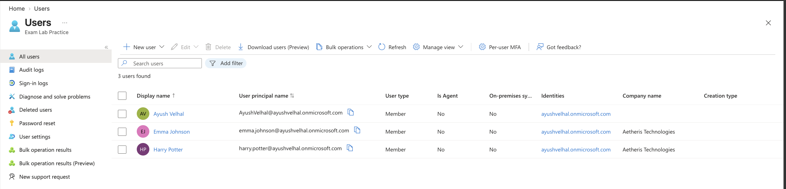

### 2. Simulation Overview
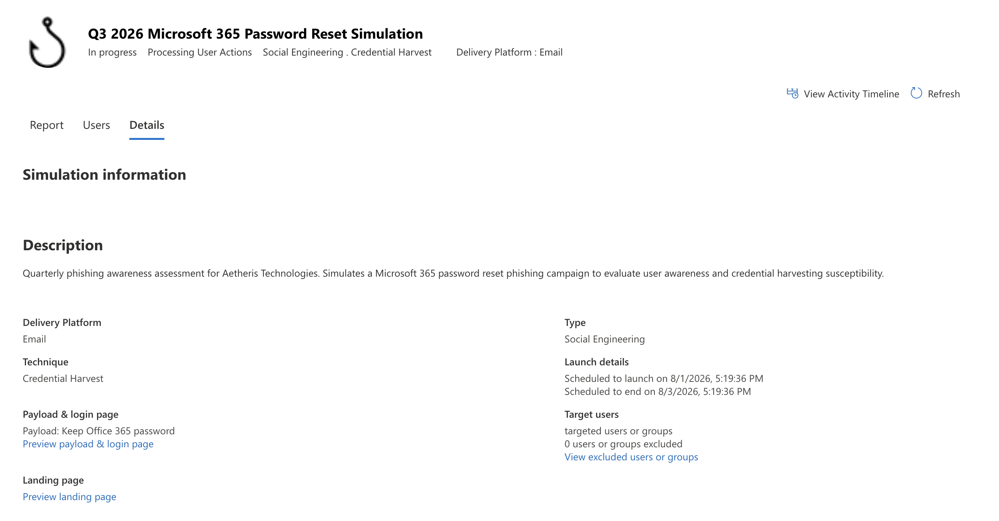

### 3. User Compromise Evidence
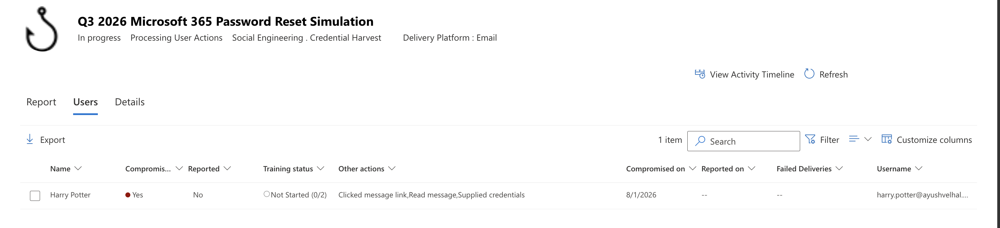

### 4. Phishing Email Delivered
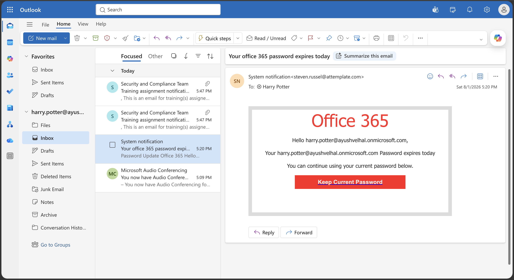

### 5. Phishing Landing Page
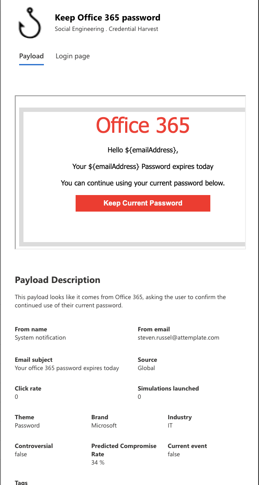

### 6. Security Awareness Training Page
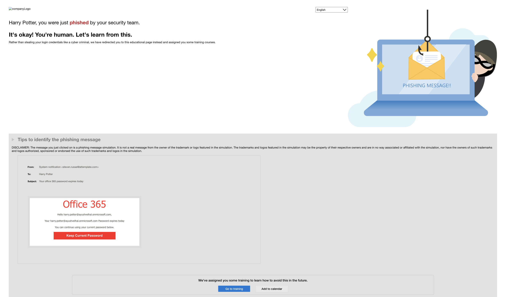

### 7. Simulation Report Dashboard
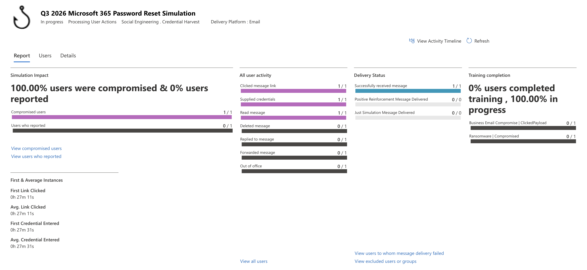

### 8. Activity Timeline
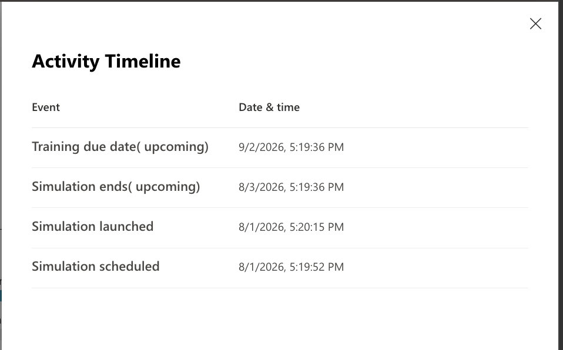

### 9. Training Assignment Email
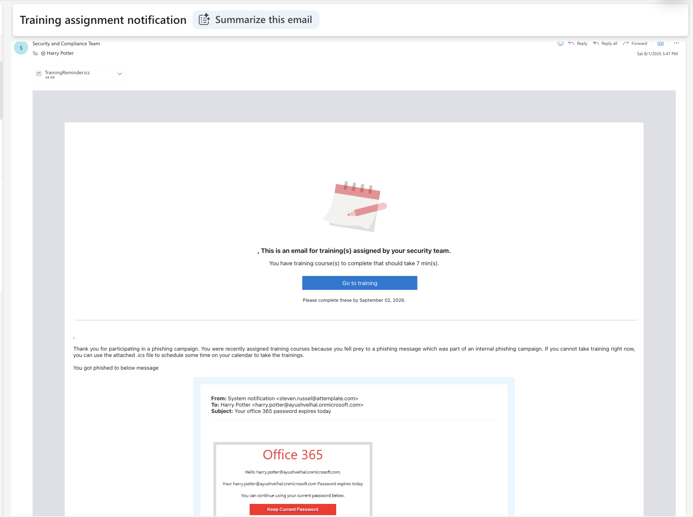

### 10. Security Awareness Training Assignment
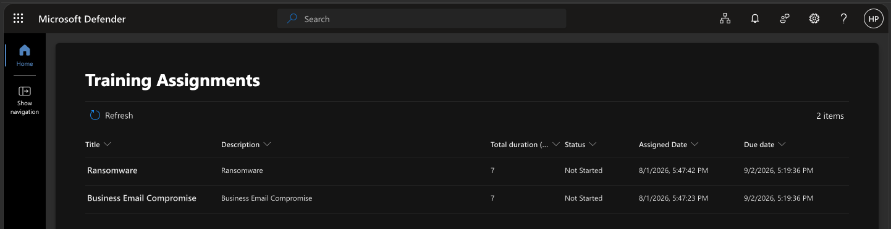

### 11. Security Awareness Training Module
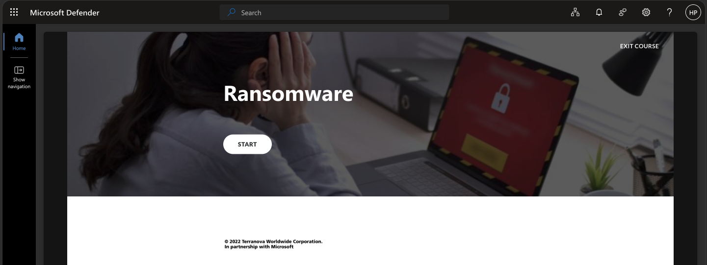

### 12. User Compromise Report
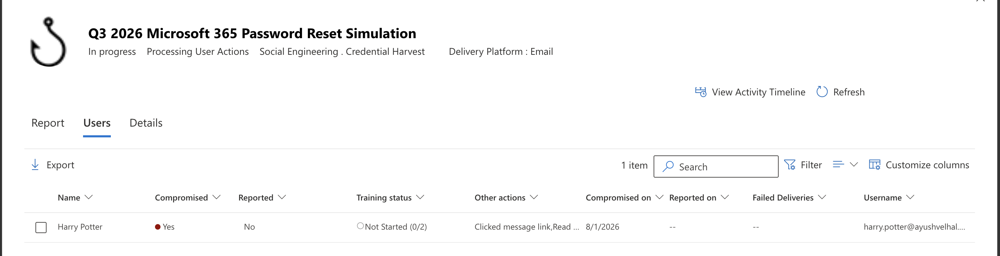

---

## Key Outcomes

- Successfully executed a credential harvesting phishing simulation.
- Validated phishing email delivery through Microsoft Defender.
- Captured simulated credential submission events.
- Investigated user actions through Defender reporting.
- Demonstrated Microsoft's automated security awareness training workflow.
- Documented the complete phishing simulation lifecycle from attack to remediation.

---

## Author

**Ayush Velhal**

Bachelor of Science in Computer Science  
University of Texas at Dallas

Interested in Cybersecurity, SOC Operations, Cloud Security, and Microsoft Security.